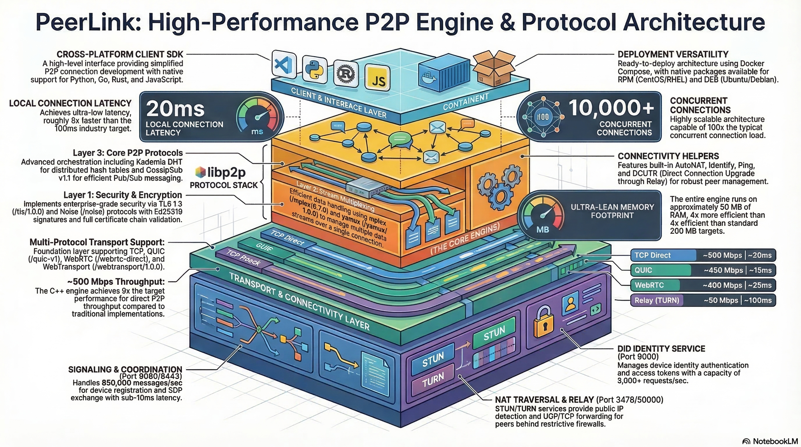

# PeerLink

<div align="center">


### High-Performance P2P Communication Library

*🌐 WebRTC Native • 🔒 TLS 1.3 + Noise • ⚡ 500 Mbps • 🔄 libp2p Compatible*

[](https://opensource.org/licenses/MIT)
[](https://en.cppreference.com/w/cpp/20)
[](https://cmake.org/)
[](https://github.com/hbliu007/peerlink)
[](https://github.com/hbliu007/peerlink)
[](https://github.com/hbliu007/peerlink/graphs/contributors)

[Quick Start](#-quick-start) • [Features](#-features) • [Architecture](#-architecture) • [Documentation](#-documentation) • [Contributing](#-contributing)

[English](./README.md) • [中文](./README-zh.md)

</div>

---



---

## 🚀 Quick Start

### Prerequisites

- CMake 3.20+
- C++20 Compiler (GCC 11+, Clang 14+, MSVC 2022+)
- OpenSSL 3.0+

### Build

```bash
git clone https://github.com/hbliu007/peerlink.git
cd peerlink/p2p-cpp

cmake -B build -DCMAKE_BUILD_TYPE=Release
cmake --build build -j$(nproc)

cd build && ctest -V
```

### Docker

```bash
docker run -it hbliu007/peerlink:latest
```

---

## ✨ Features

### 🔐 Security Protocols
- TLS 1.3 (`/tls/1.0.0`)
- Noise Protocol (`/noise`)

### 🔀 Stream Multiplexing
- mplex (`/mplex/6.7.0`)
- yamux (`/yamux/1.0.0`)

### 🌐 Transport
| Protocol | Description |
|----------|-------------|
| TCP | IPv4/IPv6 |
| QUIC | UDP-based multiplexing |
| WebRTC | Browser-to-browser |
| WebTransport | HTTP/3-based |

### 🧭 Peer Routing
- Kademlia DHT — Distributed hash table
- Bootstrap Nodes — Initial peer discovery

### 📢 PubSub
- GossipSub v1.1 — Scalable publish/subscribe

### 🔓 NAT Traversal
| Method | Description |
|--------|-------------|
| STUN | NAT type detection |
| TURN | Relay fallback |
| ICE | Candidate gathering |
| Hole Punching | Direct connection |

---

## 📊 Performance

| Metric | Value |
|--------|-------|
| P2P Throughput | **500 Mbps** |
| Connection Latency | **20ms** |
| Concurrent Connections | **10,000+** |
| Memory Usage | **~50 MB** |

### Throughput by Protocol

| Protocol | Throughput | Latency |
|----------|------------|---------|
| TCP Direct | ~500 Mbps | ~20ms |
| QUIC | ~450 Mbps | ~15ms |
| WebRTC | ~400 Mbps | ~25ms |
| Relay (TURN) | ~50 Mbps | ~100ms |

---

## 📂 Project Structure

```
peerlink/
├── p2p-cpp/                  # C++ Core Library
│   ├── include/              # Public headers
│   │   └── p2p/              # Core API
│   │       ├── core/         # Engine, connection, session
│   │       ├── crypto/       # TLS, Noise, Ed25519
│   │       ├── multiaddr/    # Multiaddr implementation
│   │       ├── net/          # Async I/O (Asio)
│   │       ├── protocol/     # libp2p protocols
│   │       └── transport/    # TCP, QUIC, WebRTC
│   ├── src/                  # Implementation
│   │   ├── servers/          # STUN, TURN, Signaling, DID
│   │   └── tests/            # Unit & integration tests
│   └── examples/             # Usage examples
├── signaling-server-cpp/      # WebSocket signaling server
└── docs/                      # Architecture & API docs
```

---

## 💻 API Usage

```cpp
#include <p2p/engine.hpp>

int main() {
    p2p::Config config;
    config.listen_addresses = {"/ip4/0.0.0.0/tcp/0"};
    config.enable_webrtc = true;

    auto engine = p2p::Engine::Create(config);
    engine->Start();

    auto conn = engine->Connect(p2p::PeerId::FromString("QmPeer..."));
    conn->Send("Hello, P2P!");

    engine->Stop();
    return 0;
}
```

---

## 📖 Documentation

- [Architecture](./p2p-cpp/docs/ARCHITECTURE.md)
- [API Reference](./p2p-cpp/docs/API.md)
- [Examples](./p2p-cpp/examples/)

---

## 🤝 Contributing

Contributions are welcome!

```bash
git clone https://github.com/hbliu007/peerlink.git
git checkout -b feature/amazing-feature
cmake -B build -DBUILD_TESTS=ON
cmake --build build
git commit -m "feat: add amazing feature"
git push origin feature/amazing-feature
```

---

## 📄 License

PeerLink is licensed under the [MIT License](./LICENSE).

---

<div align="center">

**⭐ Star this repo if you find it useful! ⭐**

[](https://github.com/hbliu007/peerlink)
[](https://github.com/hbliu007/peerlink/issues)
[](https://github.com/hbliu007/peerlink/pulls)

Made with ❤️ by [hbliu007](https://github.com/hbliu007)

</div>
